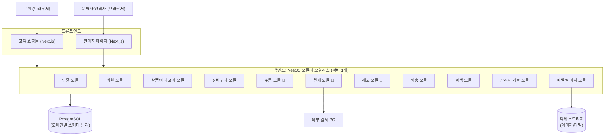
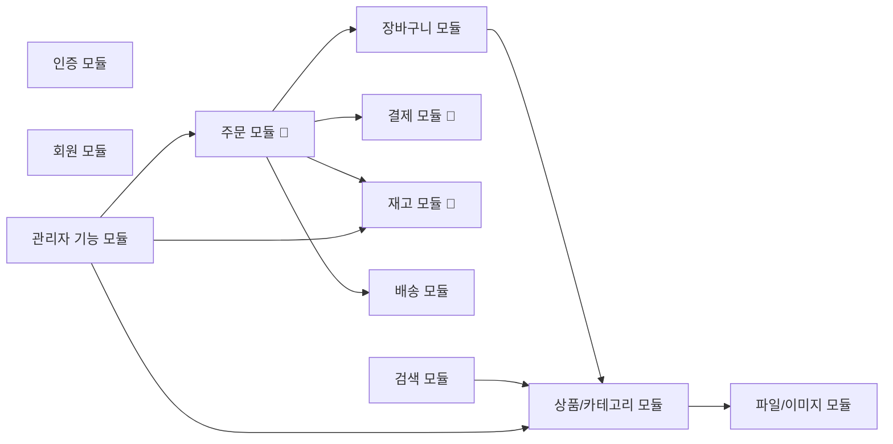
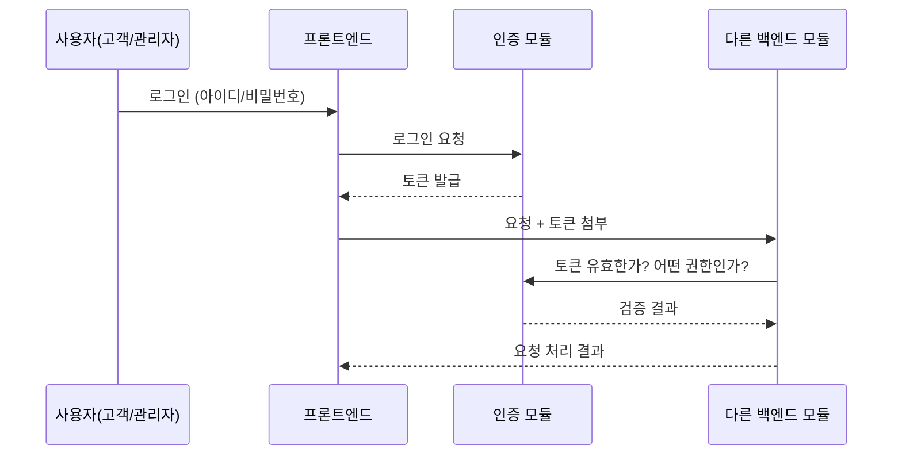
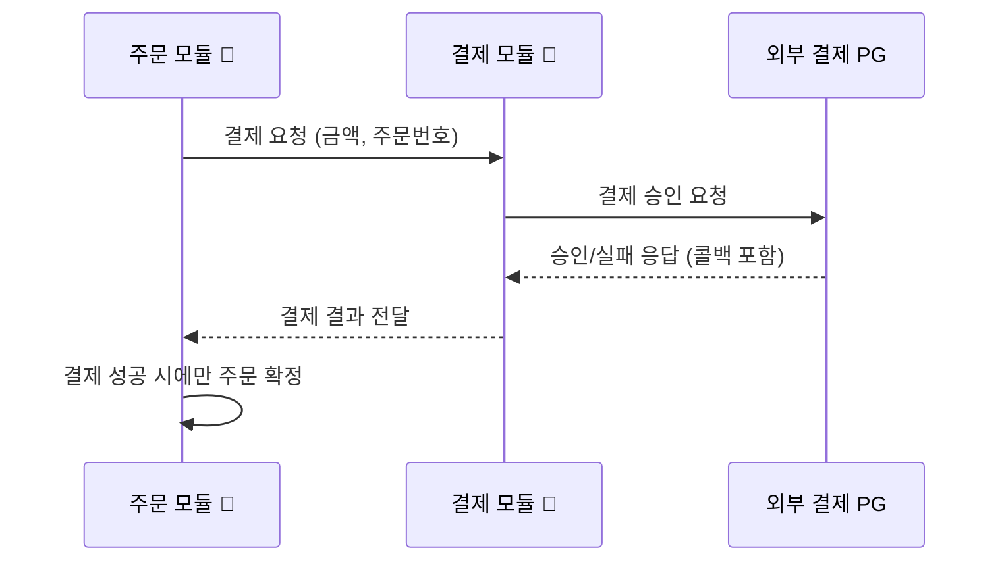
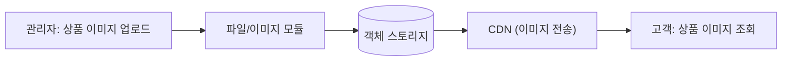
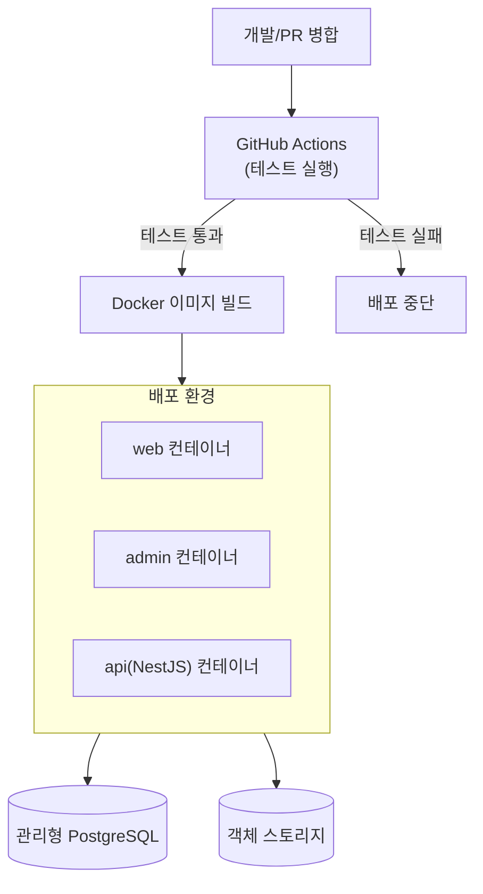

# 아키텍처 개요 (Architecture Overview)

> 상태: 초안 (Draft) — 설계 승인자(기획자) 검토 필요
> 관련 문서: `docs/00_project/project-scope.md`, `docs/01_architecture/tech-stack-decision.md`
> 전제: 처음부터 MSA(마이크로서비스)로 시작하지 않고 **모듈러 모놀리스**로 시작하되, 주문/결제/재고/검색은 나중에 분리할 수 있도록 경계를 명확히 둔다.

---

## 1. 전체 아키텍처 개요

가장 단순하게 표현하면 이렇다. **"하나의 백엔드 서버 안에, 각 업무 영역이 서로 침범하지 않도록 칸막이가 쳐진 방들이 모여있는 구조"** 다. 방을 나중에 다른 건물로 옮기기 쉽도록, 처음부터 방과 방 사이에 문(정해진 통로)만 두고 벽을 뚫어놓지 않는다.



- **프론트엔드**: 고객용 쇼핑몰과 관리자 페이지를 분리한다.
- **백엔드**: 지금은 서버 1개(하나의 프로그램)로 배포하지만, 내부는 업무 영역별 "모듈"로 나뉘어 있다.
- **DB**: 하나의 PostgreSQL을 쓰되, 업무 영역별로 스키마(구역)를 나눈다.
- **외부 연동**: 결제(PG), 이미지 저장(객체 스토리지)은 각각 정해진 모듈을 통해서만 연결된다.

---

## 2. 모듈러 모놀리스로 시작하는 이유

"모듈러 모놀리스"란 겉보기엔 서버 하나(모놀리스)지만, 내부는 미리 정한 규칙에 따라 영역이 나뉘어 있는(모듈러) 구조다. 처음부터 MSA(주문 서버, 결제 서버, 재고 서버를 완전히 따로 만드는 방식)로 시작하지 않는 이유는 다음과 같다.

| 이유 | 설명 |
|---|---|
| 서버 간 통신 복잡도 없음 | MSA는 서버끼리 네트워크로 통신해야 해서 "일부만 성공하고 일부만 실패"하는 상황을 항상 대비해야 한다. 모놀리스는 하나의 프로그램 안에서 함수를 호출하는 것과 같아 훨씬 단순하다 |
| 배포/운영이 단순함 | 서버가 1개이므로 배포 파이프라인, 모니터링, 장애 대응이 단순해진다. 팀 규모가 작을 때 특히 유리하다 |
| 검수하기 쉬움 | 기획자가 검수할 때 "어느 서버에서 무슨 일이 일어났는지"를 여러 서버에 흩어서 추적할 필요가 없다 |
| AI 에이전트 작업에 유리 | Claude Code가 기능 하나를 구현할 때, 여러 서버/저장소를 오가지 않고 한 코드베이스 안에서 계획-구현-테스트를 완결할 수 있다 |
| 그럼에도 나중에 분리 가능 | 지금부터 모듈 간 경계(통신 규칙)를 지키면, 트래픽이 커졌을 때 특정 모듈만 별도 서버로 떼어내는 작업이 "재설계"가 아니라 "이사"에 가까운 수준으로 쉬워진다 |

즉, "당장 필요 없는 복잡함은 만들지 않되, 나중에 필요해질 복잡함(분리)은 오늘 미리 대비해둔다"는 원칙이다.

---

## 3. 프론트엔드 구조

고객용 쇼핑몰과 관리자 페이지를 **별도의 Next.js 애플리케이션**으로 분리한다. (같은 저장소 안에서 폴더만 나누는 "모노레포" 방식)

```
apps/
  web/     ← 고객용 쇼핑몰 (상품 탐색, 장바구니, 주문, 결제)
  admin/   ← 관리자 페이지 (상품 관리, 주문 관리)
packages/
  ui/      ← 두 앱이 함께 쓰는 디자인 요소 (버튼, 입력창 등 shadcn/ui 기반)
  types/   ← 두 앱이 함께 쓰는 데이터 형식 정의
```

**왜 분리하는가**: 고객 화면과 관리자 화면은 보안 수준과 사용자층이 완전히 다르다. 처음부터 분리해두면, 이후 "관리자 페이지만 사내망에서만 접속 가능하게 하기" 같은 보안 강화도 프론트엔드를 다시 만들지 않고 가능하다. 또한 실수로 관리자 기능이 고객 화면에 노출되는 사고도 구조적으로 막을 수 있다.

---

## 4. 백엔드 구조

NestJS 하나의 프로그램(서버) 안에서, 업무 영역별로 "모듈"을 나눈다. 각 모듈은 자기 영역의 화면 요청 처리, 업무 로직, DB 접근을 모두 포함하며, **다른 모듈의 내부(DB 테이블, 내부 함수)에 직접 접근하지 않고 정해진 창구(서비스 인터페이스)로만 소통**한다.



- 화살표는 "누가 누구에게 요청하는지"를 뜻한다. 예를 들어 주문 모듈은 재고 모듈에게 "재고를 차감해줘"라고 요청하지만, 재고 모듈의 내부 DB 테이블을 직접 들여다보지 않는다.
- **카탈로그(상품) 모듈은 다른 모듈에 의존하지 않는 가장 기초 모듈**이다. 이렇게 의존 방향을 한쪽으로만 흐르게 해야 나중에 얽힌 것을 풀기 쉽다.

---

## 5. DB 구조

하나의 PostgreSQL 데이터베이스를 쓰되, 업무 영역별로 **스키마(데이터베이스 안의 구역)**를 나눈다. 스키마는 폴더라고 생각하면 이해하기 쉽다.

```
PostgreSQL (1개 데이터베이스)
├── users 스키마      (회원, 관리자 계정)
├── catalog 스키마    (상품, 카테고리)
├── order 스키마 🔴   (장바구니, 주문, 주문상품)
├── payment 스키마 🔴 (결제 내역)
├── inventory 스키마 🔴 (재고)
├── shipping 스키마   (배송지, 배송상태)
└── search 스키마     (검색 관련 보조 데이터, MVP는 최소화)
```

**핵심 원칙**: 나중에 분리하기로 한 영역(주문/결제/재고/검색)은 **다른 스키마의 테이블과 직접 조인(JOIN)하지 않는다.** 대신 ID 값만 저장해서 참조한다. (예: 주문 테이블에는 상품의 상세 정보를 복사하지 않고 `product_id`만 저장하고, 필요하면 카탈로그 모듈에 다시 물어본다) 이렇게 해야 나중에 스키마를 별도 데이터베이스로 떼어낼 때 "얽혀있는 조인을 다 풀어야 하는" 큰 작업을 피할 수 있다.

---

## 6. 인증 구조

- 고객과 관리자는 **완전히 분리된 로그인 체계**를 사용한다. (같은 토큰/권한으로 섞이지 않음)
- 로그인에 성공하면 서버가 "출입증"과 같은 토큰(JWT)을 발급하고, 이후 모든 요청에는 이 토큰을 함께 제출해야 한다.
- 토큰에는 "이 사람이 고객인지 관리자인지, 어떤 권한이 있는지"가 담겨 있고, 서버는 매 요청마다 이를 확인한다.



- MVP 단계에서는 관리자/운영자를 하나의 권한으로 통합한다(`project-scope.md` 참고). 추후 권한을 세분화해도 이 구조(토큰 기반 인증)는 그대로 유지된다.

---

## 7. 관리자 시스템 구조

- 관리자 페이지(`apps/admin`)는 고객용 쇼핑몰과 별도의 화면이지만, **같은 백엔드 서버**의 "관리자 기능 모듈"과 각 업무 모듈의 관리자 전용 창구를 호출한다.
- 관리자 전용 API는 일반 고객 토큰으로는 접근할 수 없도록 서버에서 권한을 검사한다(관리자 권한이 없으면 요청 자체가 거부됨).
- 상품 관리·주문 관리 화면은 각각 카탈로그 모듈, 주문 모듈의 관리자용 기능을 그대로 사용하고, 별도로 데이터를 복제하지 않는다. (데이터가 두 곳에 따로 존재하면 불일치가 생기기 쉬우므로)

---

## 8. 외부 결제 PG 연동 위치

- 외부 결제사(PG)와의 통신은 **오직 결제 모듈에서만** 이루어진다. 주문 모듈이나 다른 모듈이 PG를 직접 호출하는 일은 없다.
- 이렇게 하면 나중에 결제사를 바꾸거나 추가해도 결제 모듈만 수정하면 되고, 다른 모듈은 영향을 받지 않는다.



- PG의 결과 통보(웹훅/콜백)도 결제 모듈이 받아서 처리한 뒤, 그 결과만 주문 모듈에 알려준다. 이 흐름은 위험 영역(4장의 결제 관련 사전 보고 규칙)에 해당하므로 설계 변경 시 반드시 사전 승인을 받는다.

---

## 9. 파일/이미지 저장 구조

- 상품 이미지 등 파일은 서버 안에 직접 저장하지 않고, **외부 객체 스토리지(예: AWS S3 또는 호환 서비스)**에 저장한다.
- DB에는 이미지 파일 자체가 아니라 "이미지가 저장된 주소(URL)"만 저장한다.
- 이렇게 하면 서버를 늘리거나 재배포해도 이미지가 사라지지 않고, 이미지 전용 배포망(CDN)을 통해 더 빠르게 보여줄 수 있다.



---

## 10. 배포 구조

- 프론트엔드(고객용/관리자용), 백엔드 각각을 Docker 컨테이너로 만들어 배포한다.
- GitHub Actions가 "테스트 통과 → 이미지 빌드 → 배포"를 자동으로 수행한다. (테스트 실패 시 배포 중단 — 절대 규칙 8과 동일한 원칙)
- 데이터베이스는 직접 운영하지 않고 관리형 PostgreSQL 서비스 사용을 권장한다. (백업/장애 대응 부담을 줄이기 위함)



---

## 11. 향후 MSA 분리 가능 영역

아래 네 영역은 처음부터 "언젠가 별도 서버로 분리될 수 있다"는 전제로 경계를 관리한다.

| 영역 | 분리하는 이유(예상) |
|---|---|
| 주문 🔴 | 트래픽이 몰릴 때(할인 행사 등) 다른 기능과 분리해 독립적으로 확장하기 위해 |
| 결제 🔴 | 보안 요구 수준이 다르고, PG 연동 특성상 독립 배포/장애 격리가 유리 |
| 재고 🔴 | 동시성 처리가 중요한 영역이라 전용 자원과 최적화가 필요할 수 있음 |
| 검색 | 상품 수가 많아지면 전용 검색엔진(Elasticsearch 등)으로 옮기는 경우가 많음 |

**분리가 쉬운 이유**: 지금부터 각 모듈이 서로의 DB를 직접 들여다보지 않고, 정해진 창구(서비스 인터페이스)로만 소통하도록 관리하면, 분리 시에는 그 창구를 "함수 호출"에서 "네트워크 호출(API)"로 바꾸기만 하면 된다. 업무 로직 자체를 다시 설계할 필요가 없다.

---

## 12. AI 에이전트가 작업할 때 지켜야 할 모듈 경계

Claude Code가 백엔드 기능을 구현할 때 반드시 지켜야 할 규칙이다. (기존 작업 원칙의 절대 규칙 3 "요청 범위 밖 파일 수정 금지"의 구체적 적용 방식이다)

1. **다른 모듈의 DB 테이블/엔티티에 직접 접근하지 않는다.** 필요한 정보는 반드시 해당 모듈이 공개한 서비스 함수를 통해서만 가져온다.
2. **다른 모듈의 내부 폴더/파일을 임의로 수정하지 않는다.** 예를 들어 주문 기능을 개발하다가 재고 모듈의 내부 로직을 고쳐야 할 것 같으면, 먼저 사용자에게 보고하고 승인을 받는다. (에스컬레이션 기준과 동일)
3. **도메인 간 데이터는 ID로만 참조한다.** 특히 주문/결제/재고/검색 스키마 사이에는 조인(JOIN)이나 데이터 복제를 하지 않는다.
4. **공용 로직은 지정된 공용 모듈(shared/common)에만 추가한다.** 여러 모듈에 같은 코드를 복사해서 넣지 않는다.
5. **모듈 경계를 넘는 변경이 필요하면 먼저 계획을 보고한다.** "이 기능을 구현하려면 A 모듈과 B 모듈을 동시에 고쳐야 한다"는 판단이 서면, 구현 전에 반드시 계획과 영향범위를 먼저 제시한다. (절대 규칙 1, 2와 동일한 원칙)
6. **주문/결제/재고 모듈을 수정할 때는 민감 영역 처리 지침을 함께 따른다.** (작업 원칙 문서의 `docs/rules-sensitive-domain.md` 참고)

---

## 13. 승인 체크리스트

- [ ] 전체 구조(모듈러 모놀리스, 도메인 경계) 이해 및 동의
- [ ] 프론트엔드 구조(웹/관리자 분리) 승인
- [ ] DB 스키마 분리 방식 승인
- [ ] 결제 PG 연동 위치 및 흐름 승인
- [ ] 다음 단계(각 모듈별 상세 설계, DB 테이블 설계) 진행 승인

> 승인 전까지는 초안(Draft) 상태이며, 코드는 작성하지 않는다.
