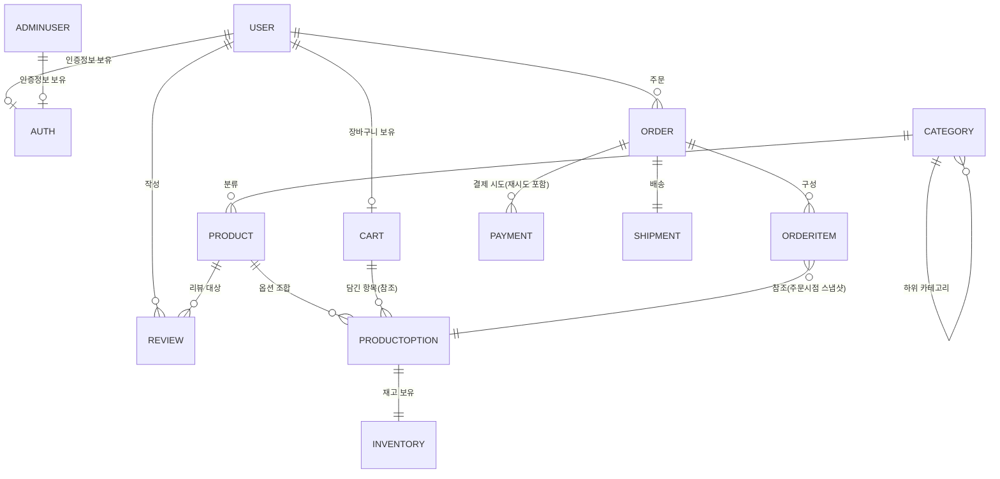
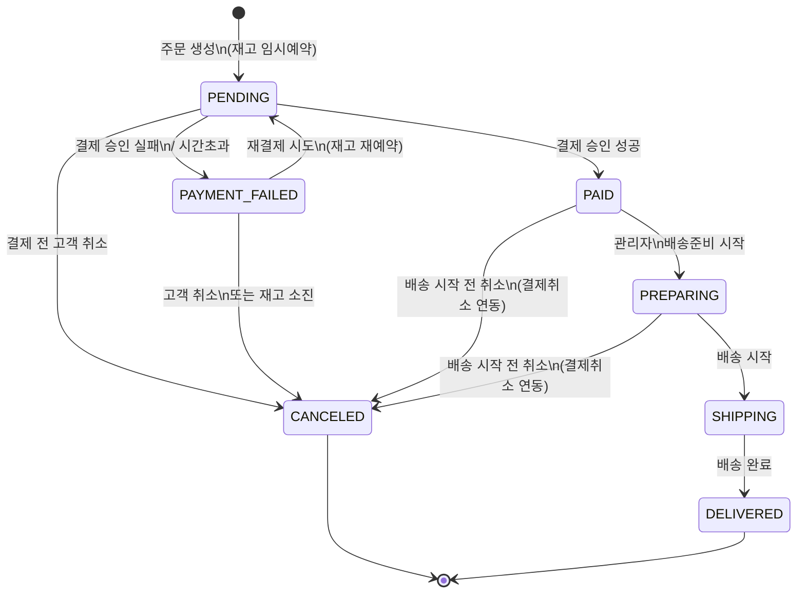
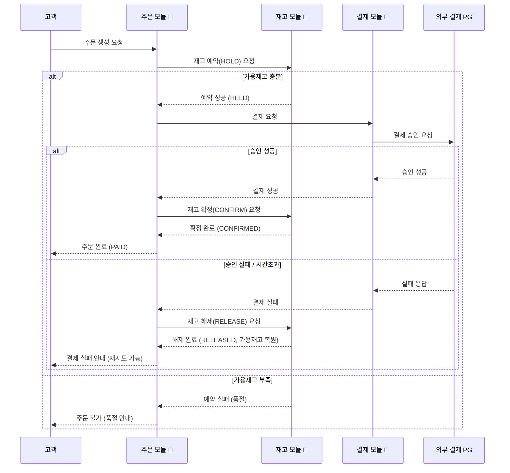
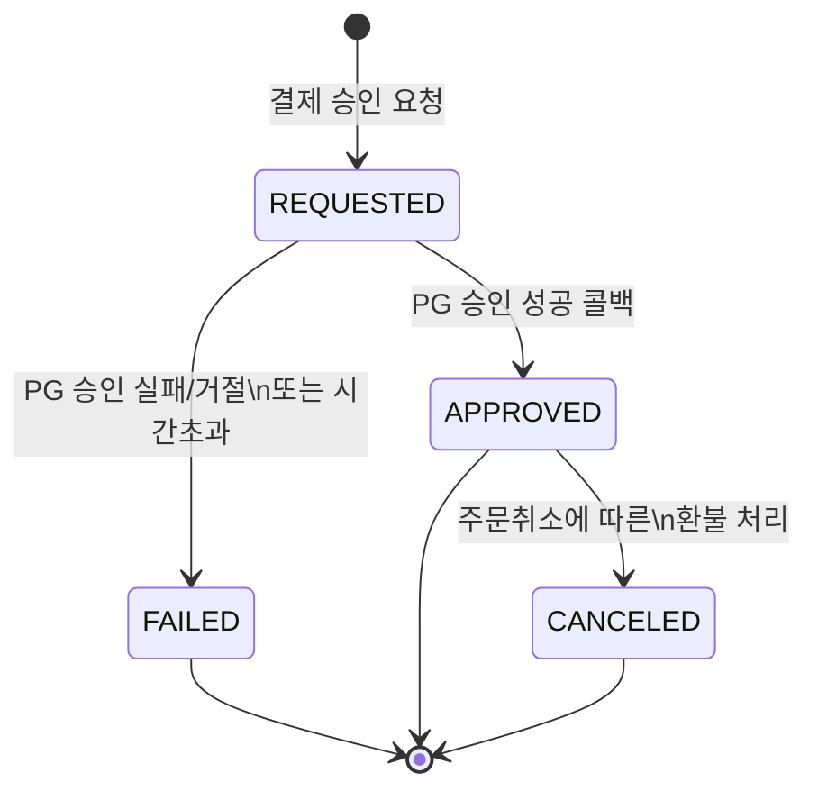

# 도메인 모델 (Domain Model)

> 상태: 초안 (Draft) — 설계 승인자(기획자) 검토 필요
> 관련 문서: `docs/00_project/project-scope.md`, `docs/01_architecture/architecture-overview.md`
> 이 문서는 코드가 아니라 "이 서비스에 어떤 개념들이 있고, 그것들이 서로 어떻게 얽혀 있는지"를 정의하는 문서다.

---

## 0. 이번 설계에서 확정한 핵심 정책

아래 3가지는 도메인 전체 구조에 큰 영향을 주는 결정으로, 사전에 논의를 거쳐 확정했다.

| 결정 항목 | 확정 내용 |
|---|---|
| 재고 차감 시점 | **주문 생성 시 임시 예약(HOLD)** → 결제 성공 시 확정 차감, 결제 실패/시간초과 시 자동 복원 |
| 상품 옵션별 재고 관리 | **옵션 조합별로 재고 관리** (예: "빨강/L" 재고와 "파랑/M" 재고를 따로 관리) |
| 결제 실패 시 주문 처리 | **주문을 "결제실패" 상태로 유지**하고 고객의 재결제 시도를 허용 |

이 세 결정은 아래 도메인 정의와 4~10장의 상세 흐름에 일관되게 반영되어 있다.

---

## 1. 도메인 관계도 (전체 구조)

**읽는 법**: `A ||--o{ B`는 "A 1개에 B가 0개 이상 연결될 수 있다"는 뜻이다. 예를 들어 `ORDER ||--o{ ORDERITEM`은 "주문 1건에는 주문상품이 여러 개 있을 수 있다"는 의미다.

---

## 2. 도메인별 정의

### 2-1. User (회원)

- **역할**: 서비스를 이용하는 일반 고객 계정
- **주요 속성**: 이름, 이메일, 전화번호, 가입일, 회원 상태
- **관계**: `Auth`(인증정보, 1:1) / `Cart`(1:1) / `Order`(1:N) / `Review`(1:N)
- **주요 상태값**: `ACTIVE`(정상), `DORMANT`(휴면), `WITHDRAWN`(탈퇴)
- **비즈니스 규칙**
  - 이메일은 중복 가입이 불가하다.
  - 탈퇴 회원이라도 과거 주문 이력은 즉시 삭제하지 않는다(전자상거래법상 일정 기간 보관 의무 있음).
- **AI가 임의로 판단하면 안 되는 정책**
  - 회원 탈퇴 시 개인정보를 "어디까지, 얼마나 오래" 보관/삭제할지는 법적 요건이 얽혀 있으므로 임의로 삭제 로직을 구현하지 않는다. 반드시 사전 확인 후 진행한다.

### 2-2. Auth (인증)

- **역할**: 로그인, 토큰 발급/검증 등 인증 로직만 전담하는 도메인 (User/AdminUser의 개인정보와 분리)
- **주요 속성**: 인증방식, 비밀번호 해시, 리프레시 토큰, 로그인 실패 횟수, 최근 로그인 시각
- **관계**: `User`(1:1), `AdminUser`(1:1) — 고객용과 관리자용은 별도 체계로 분리 운영(`architecture-overview.md` 6장 참고)
- **주요 상태값**: 없음 (토큰의 유효/만료로 판단)
- **비즈니스 규칙**
  - 비밀번호는 반드시 해시로 저장하고 평문으로 저장/로그 출력하지 않는다.
  - 로그인 실패가 반복되면 일정 시간 잠그는 등의 보호 장치가 필요하다. (➕ 확인 필요: 구체적 잠금 임계치/시간)
- **AI가 임의로 판단하면 안 되는 정책**
  - 비밀번호 해싱 방식, 토큰 만료 시간, 로그인 실패 잠금 임계치 등 보안 정책의 구체적 수치는 임의로 정하지 않고 사전 승인을 받는다.

### 2-3. Product (상품)

- **역할**: 판매 대상 상품의 기본 정보
- **주요 속성**: 상품명, 설명, 기본가격, 대표이미지, 소속 카테고리, 판매상태
- **관계**: `Category`(N:1), `ProductOption`(1:N), `Review`(1:N)
- **주요 상태값**: `ON_SALE`(판매중), `HIDDEN`(숨김), `DISCONTINUED`(단종)
- **비즈니스 규칙**
  - 단종(`DISCONTINUED`) 처리된 상품은 신규 주문이 불가하지만, 과거 주문 내역에는 그대로 표시되어야 한다.
  - 상품 가격을 변경해도 이미 주문이 완료된 건의 가격에는 영향을 주지 않는다(주문 시점 가격은 `OrderItem`에 별도로 저장됨).
- **AI가 임의로 판단하면 안 되는 정책**
  - 판매 이력이 있는 상품은 삭제(하드 삭제)하지 않고 단종 처리로 전환해야 한다. 임의로 삭제 기능을 구현하지 않는다.

### 2-4. Category (카테고리)

- **역할**: 상품 분류 체계 (계층 구조 가능: 대분류 → 중분류 등)
- **주요 속성**: 카테고리명, 상위 카테고리, 노출 순서
- **관계**: `Product`(1:N), 자기 자신과의 관계(상위-하위 카테고리)
- **주요 상태값**: 없음 (노출/숨김 정도)
- **비즈니스 규칙**
  - 카테고리를 삭제할 때 소속 상품을 어떻게 처리할지 정책이 필요하다. (➕ 확인 필요: 다른 카테고리로 이동 / 미분류로 전환 / 삭제 자체를 막음 중 선택)
- **AI가 임의로 판단하면 안 되는 정책**
  - 카테고리 삭제 시 소속 상품까지 함께 삭제하는 로직은 절대 임의로 구현하지 않는다.

### 2-5. ProductOption (상품 옵션)

- **역할**: 상품의 세부 옵션 조합(예: 색상×사이즈)을 표현하는, 실제 판매/재고 관리의 최소 단위
- **주요 속성**: 옵션조합명(예: "빨강/L"), 옵션별 추가금액, 옵션 상태
- **관계**: `Product`(N:1), `Inventory`(1:1) — 옵션 조합마다 재고를 따로 가진다(0장 결정사항)
- **주요 상태값**: `ACTIVE`(판매중), `SOLD_OUT`(품절), `HIDDEN`(숨김)
- **비즈니스 규칙**
  - 해당 옵션의 가용재고가 0이 되면 자동으로 `SOLD_OUT` 상태로 전환되어 신규 주문이 불가능해야 한다.
  - 옵션별 최종 판매가 = 상품 기본가격 + 옵션 추가금액.
- **AI가 임의로 판단하면 안 되는 정책**
  - 옵션 추가금액, 품절 임계치 등은 기획자가 입력한 상품 데이터를 그대로 따르며, 임의의 기본값을 생성해 넣지 않는다.

### 2-6. Cart (장바구니)

- **역할**: 고객이 구매를 확정하기 전 담아두는 임시 목록
- **주요 속성**: 장바구니에 담긴 항목(상품옵션, 수량), 담은 시각
- **관계**: `User`(1:1), `ProductOption`(N:1, 항목별 참조)
- **주요 상태값**: 없음
- **비즈니스 규칙**
  - **장바구니에 담는 행위는 재고를 예약하지 않는다.** 재고 예약은 오직 "주문 생성" 시점에만 발생한다(0장 결정사항). 따라서 장바구니에 있다고 해서 구매가 보장되지 않으며, 주문 시점에 품절일 수 있다.
- **AI가 임의로 판단하면 안 되는 정책**
  - 장바구니 담기 시점에 재고를 임시로 잠그는(예약하는) 로직을 임의로 추가하지 않는다. 이는 설계상 명시적으로 배제된 방식이다.

### 2-7. Order (주문) 🔴 위험 영역

- **역할**: 고객의 구매 확정 단위. 결제/재고/배송을 아우르는 프로젝트의 중심 도메인
- **주요 속성**: 주문번호, 주문자, 주문일시, 총 결제금액, 배송지, 주문 상태
- **관계**: `User`(N:1), `OrderItem`(1:N), `Payment`(1:N — 재결제 이력을 포함), `Shipment`(1:1)
- **주요 상태값**: `PENDING`, `PAID`, `PAYMENT_FAILED`, `PREPARING`, `SHIPPING`, `DELIVERED`, `CANCELED` (4장에서 상세 설명)
- **비즈니스 규칙**
  - 하나의 주문은 여러 번의 결제 시도(재결제 포함)를 가질 수 있지만, 최종적으로 유효한(승인된) 결제는 단 하나여야 한다.
  - 주문 총액은 `OrderItem`의 소계 합계와 항상 일치해야 한다.
- **AI가 임의로 판단하면 안 되는 정책**
  - 주문 상태 전이 규칙은 반드시 4장에 정의된 흐름만 따른다. 문서에 없는 상태나 전이를 임의로 추가하지 않는다.

### 2-8. OrderItem (주문 상품)

- **역할**: 주문에 포함된 개별 상품(옵션)과 수량, 그리고 **주문 시점 가격의 스냅샷**
- **주요 속성**: 상품/옵션 참조, 수량, 주문시점 단가(스냅샷), 소계금액
- **관계**: `Order`(N:1), `ProductOption`(N:1, 참조)
- **주요 상태값**: 없음 (주문 상태를 따름 — 부분취소/부분환불은 2차 고도화 범위)
- **비즈니스 규칙**
  - 주문시점 단가는 이후 상품 가격이 바뀌어도 변하지 않는다(스냅샷으로 별도 저장).
- **AI가 임의로 판단하면 안 되는 정책**
  - 주문 완료 후 `OrderItem`의 가격/수량을 임의로 수정하는 기능을 만들지 않는다. 변경이 필요하면 취소 후 재주문으로 처리한다.

### 2-9. Inventory (재고) 🔴 위험 영역

- **역할**: 옵션 조합(`ProductOption`)별 실제 판매 가능 수량을 관리
- **주요 속성**: 총 재고수량, 예약수량(HOLD 중인 수량), 가용재고(=총재고−예약수량)
- **관계**: `ProductOption`(1:1)
- **주요 상태값** (재고 예약 건 기준): `HELD`(예약중), `CONFIRMED`(확정차감), `RELEASED`(해제/복원됨)
- **비즈니스 규칙** (5장에서 상세)
  - 주문 생성 시 예약(HELD), 결제 성공 시 확정(CONFIRMED), 결제 실패/시간초과/주문취소 시 해제(RELEASED)하여 가용재고로 복원한다.
  - 동시에 여러 주문이 들어와도 가용재고 이하로만 예약이 성립해야 한다(오버셀 방지).
- **AI가 임의로 판단하면 안 되는 정책**
  - 재고 예약 유효시간(TTL), 동시성 제어 방식은 반드시 사전 설계 승인 후 구현한다. "일단 되는 방식으로 만들고 나중에 고친다"는 접근은 금지한다(작업 원칙의 절대 규칙 6, 8과 직결).

### 2-10. Payment (결제) 🔴 위험 영역

- **역할**: 외부 PG를 통한 실제 결제 승인/실패/취소 처리 및 이력 관리
- **주요 속성**: 결제시도 식별자, 주문 참조, 결제수단, 결제금액, PG거래번호, 결제상태, 요청/응답 시각
- **관계**: `Order`(N:1) — 하나의 주문에 여러 결제 시도(재결제)가 남을 수 있음
- **주요 상태값**: `REQUESTED`, `APPROVED`, `FAILED`, `CANCELED` (6장에서 상세)
- **비즈니스 규칙**
  - 하나의 주문에 대해 두 건 이상의 결제가 동시에 승인되어서는 안 된다(중복승인 방지, 7장 상세).
  - 결제 결과의 최종 확정은 반드시 PG의 서버-서버 콜백을 기준으로 한다.
- **AI가 임의로 판단하면 안 되는 정책**
  - 결제 승인/실패/취소 로직과 PG 연동 방식은 절대 임의로 구현하지 않는다. 반드시 사전 설계 승인과 결제 테스트(샌드박스) 검증을 거친다. (`docs/rules-sensitive-domain.md` 준수)

### 2-11. Shipment (배송)

- **역할**: 결제 완료된 주문의 배송 준비~완료까지 상태 관리
- **주요 속성**: 배송지, 운송장번호(있는 경우), 배송상태, 배송 시작/완료 시각
- **관계**: `Order`(1:1)
- **주요 상태값**: `PREPARING`(준비중), `SHIPPING`(배송중), `DELIVERED`(배송완료)
- **비즈니스 규칙** (8장에서 상세)
  - `SHIPPING` 상태로 전환된 이후에는 고객이 직접 주문을 취소할 수 없다.
- **AI가 임의로 판단하면 안 되는 정책**
  - MVP에서는 배송 상태를 관리자가 수동으로 변경하는 구조다. 택배사 API 자동 연동과 같은 자동화 로직을 임의로 추가하지 않는다(사전 승인 필요).

### 2-12. Review (리뷰) — 2차 고도화 대상

> `project-scope.md`에서 2차 고도화로 분류된 기능이다. 지금 구현하지는 않지만, 향후 확장을 고려해 도메인 관계만 미리 정의해둔다.

- **역할**: 구매한 상품에 대한 고객 평가
- **주요 속성**: 작성자, 대상 상품, 평점, 내용, 작성일
- **관계**: `User`(N:1), `Product`(N:1), `Order`/`OrderItem`(참조 — 실제 구매 확인용)
- **주요 상태값**: 없음 (향후 노출/숨김/신고 처리 정책 추가 가능)
- **비즈니스 규칙**
  - 실제 구매(배송완료) 이력이 있는 고객만 리뷰를 작성할 수 있어야 한다.
- **AI가 임의로 판단하면 안 되는 정책**
  - 이 도메인은 MVP 범위가 아니므로, 별도 승인 없이 구현을 진행하지 않는다.

### 2-13. AdminUser (관리자 계정)

- **역할**: 상품/주문 관리를 수행하는 관리자 계정 (`architecture-overview.md`에 따라 MVP는 관리자/운영자 권한 통합)
- **주요 속성**: 관리자 아이디, 이름, 권한, 최근 로그인 시각, 계정 상태
- **관계**: `Auth`(1:1) — 고객과는 완전히 분리된 인증 체계
- **주요 상태값**: `ACTIVE`, `DISABLED`(비활성화)
- **비즈니스 규칙**
  - 관리자 계정은 고객처럼 누구나 회원가입할 수 없으며, 시스템 관리 절차를 통해서만 생성된다.
- **AI가 임의로 판단하면 안 되는 정책**
  - 관리자 계정 생성/권한 부여 로직은 보안에 직결되므로 임의로 구현하지 않는다. 반드시 사전 승인을 받는다.

---

## 3. 주문 상태 흐름 (상세)

| 상태 | 의미 | 재고 상태 |
|---|---|---|
| `PENDING` | 주문 생성 직후, 결제 진행 중 | 예약(HELD) |
| `PAID` | 결제 승인 완료 | 확정(CONFIRMED) |
| `PAYMENT_FAILED` | 결제 승인 실패 또는 시간초과 | 해제(RELEASED) — 재고는 이미 풀려있음 |
| `PREPARING` | 관리자가 주문 확인, 상품 준비 중 | 확정(CONFIRMED) |
| `SHIPPING` | 배송 시작됨 | 확정(CONFIRMED) |
| `DELIVERED` | 배송 완료 | 확정(CONFIRMED) |
| `CANCELED` | 주문 취소 (여러 시점에서 진입 가능) | 복원(RESTORED) — 이미 확정 차감되었던 경우 |

**중요한 주의사항**: `PAYMENT_FAILED` 상태에서는 재고가 이미 풀려있기 때문에, 고객이 재결제를 시도하는 시점에 그 사이 다른 고객이 같은 옵션을 구매해 재고가 소진되어 있을 수 있다. 이 경우 재결제 시도 자체가 "품절로 인한 주문 불가"로 처리되어야 하며(5장 참고), 이는 시스템 오류가 아니라 정상적인 동작이다.

---

## 4. 주문 취소 가능 조건

| 주문 상태 | 고객 직접 취소 가능 여부 | 비고 |
|---|:---:|---|
| `PENDING` | ✅ 가능 | 결제 전 취소. 재고는 자동 해제됨 |
| `PAYMENT_FAILED` | ✅ 가능 | 재결제를 포기하는 경우 |
| `PAID` | ✅ 가능 | 배송 준비 시작 전까지. **결제취소(환불) 처리가 함께 필요** (🔴 민감 영역) |
| `PREPARING` | ✅ 가능 (➕ 운영 정책 확인 필요) | 상품을 이미 포장했을 수 있어 운영 정책상 관리자 확인이 필요할 수 있음. 결제취소(환불) 처리가 함께 필요 |
| `SHIPPING` | ❌ 불가 | 8장 참고. 반품/교환 절차로 전환(2차 고도화, MVP는 고객센터 수동 대응) |
| `DELIVERED` | ❌ 불가 | 반품/교환 절차로 전환(2차 고도화) |
| `CANCELED` | 해당 없음 | 이미 취소된 주문 |

> ➕ 확인 필요: `PREPARING` 단계에서 고객이 직접 취소 버튼을 눌러 즉시 취소되게 할지, 아니면 관리자 확인을 거치게 할지는 운영 정책으로 별도 결정이 필요하다.

---

## 5. 재고 차감/복원 흐름 (상세)

**핵심 원칙**

1. **예약(HOLD)은 "확정 판매"가 아니다.** 결제가 끝나기 전까지는 임시로 자리를 잡아둔 것일 뿐이다.
2. **동시성 보호**: 여러 고객이 동시에 같은 옵션을 주문해도, 가용재고(총재고−예약수량)를 초과해서 예약이 성립되면 안 된다. 이 부분은 반드시 "확인 후 차감"이 아니라 "조건을 만족해야만 차감되는" 원자적 방식으로 구현해야 한다 (구체적 구현 방식은 설계 단계에서 별도 승인).
3. **예약에는 유효시간(TTL)이 있어야 한다.** 고객이 결제 화면을 열어둔 채 방치하면 재고가 무한정 묶이므로, 일정 시간이 지나면 자동으로 해제되어야 한다. (➕ 확인 필요: 구체적 TTL 값, 예: 10분/15분)
4. **주문취소로 인한 복원도 동일한 재고 모듈 창구를 사용한다.** 이미 `CONFIRMED` 상태였던 재고를 취소 시 다시 가용재고로 되돌리는 흐름이며, `RELEASE`와는 별도로 "확정 후 복원(RESTORE)"으로 구분해 이력을 남긴다.

---

## 6. 결제 상태 흐름 (상세)

| 상태 | 의미 |
|---|---|
| `REQUESTED` | 결제 모듈이 PG에 승인을 요청한 직후 |
| `APPROVED` | PG로부터 승인 성공 응답을 받음 |
| `FAILED` | PG 승인 거절/오류/시간초과 |
| `CANCELED` | 승인되었던 결제를 이후 취소(환불)한 경우 |

- **하나의 주문은 여러 개의 결제 시도(Payment) 레코드를 가질 수 있다.** 재결제를 시도할 때마다 새로운 `REQUESTED` 레코드가 생성되며, 이전에 실패한 레코드는 `FAILED` 상태로 이력에 그대로 남는다(삭제하지 않음).
- 하나의 주문에 대해 **동시에 두 건 이상이 `APPROVED` 상태가 되어서는 안 된다.** (7장 중복 콜백 처리 참고)

---

## 7. 결제 실패 시 처리 (상세)

1. PG로부터 승인 실패 응답을 받거나, 일정 시간 내 응답이 없으면(시간초과) 동일하게 "결제 실패"로 처리한다.
2. 처리 순서
   - 결제 레코드를 `FAILED` 상태로 기록 (실패 사유 포함)
   - 재고 모듈에 예약 해제(RELEASE) 요청 → 가용재고 복원
   - 주문 상태를 `PAYMENT_FAILED`로 변경
   - 고객에게 실패 사실과 재시도 가능 여부를 안내
3. **재시도 시**: 새로운 결제 시도(`REQUESTED`)를 생성하기 전에 재고를 다시 예약해야 한다. 이 시점에 재고가 이미 소진되었다면, 재결제 자체가 "품절로 주문 불가"로 종료되고 주문은 `CANCELED`로 전환된다.
4. **반복 실패 대응**: 동일 주문에 대해 결제 실패가 반복되는 경우(카드 오류 반복 입력, 어뷰징 시도 등), 일정 횟수 이상이면 재시도를 제한하는 보호 장치가 필요할 수 있다. (➕ 확인 필요: 구체적 임계치/제한 방식은 사전 결정 필요 — AI가 임의로 수치를 정하지 않는다)

---

## 8. 중복 결제 콜백 처리 (상세)

PG는 네트워크 재전송 등의 이유로 **동일한 결제 건에 대한 콜백(웹훅)을 두 번 이상 보낼 수 있다.** 이를 잘못 처리하면 재고가 두 번 차감되거나 주문이 중복 확정되는 사고로 이어진다.

**처리 원칙**

1. 결제를 요청할 때마다 **고유한 멱등키(idempotency key)**(예: 주문ID + 시도순번 조합)를 함께 발급한다.
2. PG 콜백이 도착하면, 먼저 "이 멱등키로 이미 처리된 적이 있는가"를 확인한다.
   - 이미 처리된 경우: PG에는 정상 응답을 다시 보내되, 주문 확정·재고 확정·알림 발송 등 **실제 처리는 다시 실행하지 않는다.**
   - 처음 처리하는 경우에만 실제 상태 변경을 수행한다.
3. **결제 결과의 최종 확정 기준은 항상 PG의 서버-서버 콜백이다.** 고객의 브라우저가 결제 후 돌아오는 화면(리다이렉트)은 사용자에게 보여주는 용도일 뿐이며, 이 리다이렉트가 실패하거나 유실되더라도 콜백을 통해 상태가 정확히 확정되어야 한다.
4. 두 콜백이 거의 동시에 도착하는 경쟁 상황에서도 **하나의 결제만 최종 승인 처리되도록 조건부로(원자적으로) 상태를 변경**해야 한다. 구체적 구현 방식은 사전 설계 승인이 필요한 사항이다(2-10 Inventory·Payment의 "AI 임의판단 금지" 항목과 연결).

---

## 9. 배송 시작 이후 취소 제한 (상세)

- `Shipment` 상태가 `SHIPPING`으로 전환되는 순간부터, **고객의 주문취소 기능은 시스템적으로 비활성화**되어야 한다. (화면의 버튼을 숨기는 것뿐 아니라, 서버의 취소 API 자체도 이 상태에서는 요청을 거부해야 한다 — 화면 조작만으로 우회되지 않도록)
- 배송 시작 후 발생하는 문제(파손, 오배송 등)는 "취소"가 아니라 **반품/교환 절차**로 안내한다. 이 절차 자체는 2차 고도화 범위이며, MVP에서는 고객센터를 통한 수동 대응으로 처리한다.
- 예외적으로 관리자가 배송 중 회수 등의 특수 상황을 처리해야 할 경우, 고객용 "취소" 기능과는 별도로 **관리자 전용 처리 절차**로 구분한다. 이 경우도 결제 환불이 함께 필요한 민감 작업이므로 자동화하지 않고 사전 승인 하에 처리한다.

---

## 10. 종합: AI가 임의로 판단하면 안 되는 정책 모음

각 도메인 절에 흩어져 있던 항목을 한 곳에 모았다. 아래 항목은 설계 문서에 명시된 내용 이상으로 Claude Code가 스스로 값을 정하거나 로직을 확장하지 않는다.

- 회원 탈퇴 시 개인정보 보관/삭제 범위와 기간
- 로그인 실패 잠금 임계치, 토큰 만료 시간 등 보안 정책 수치
- 카테고리 삭제 시 소속 상품 처리 방식
- 상품의 하드 삭제 여부(판매 이력이 있는 상품은 단종 처리만 허용)
- 재고 예약 TTL 값, 동시성 제어(락) 구현 방식
- 결제/PG 연동 로직 전반, 결제 반복 실패 시 제한 정책
- 배송 자동화(택배사 API 연동) 도입 여부
- `PREPARING` 단계에서의 취소 허용 범위
- 관리자 계정 생성/권한 부여 로직

> 위 항목에 대한 구체적인 값/정책이 필요한 시점에는 반드시 사전 보고 후 승인을 받는다. (작업 원칙 문서의 에스컬레이션 기준과 동일)

---

## 11. 승인 체크리스트

- [x] 재고 차감 시점 (주문 생성 시 예약) 확정
- [x] 상품 옵션별 재고 관리 방식 확정
- [x] 결제 실패 시 주문 처리 방식(결제실패 상태 유지) 확정
- [ ] ➕ 확인 필요 항목 일괄 검토 (로그인 잠금 정책, 카테고리 삭제 정책, 재고 TTL, 반복결제실패 제한, PREPARING 취소 정책)
- [ ] 전체 도메인 모델 및 상태 흐름 승인
- [ ] 다음 단계(모듈별 API 설계, DB 테이블 스키마 설계) 진행 승인

> 승인 전까지는 초안(Draft) 상태이며, 코드는 작성하지 않는다.
