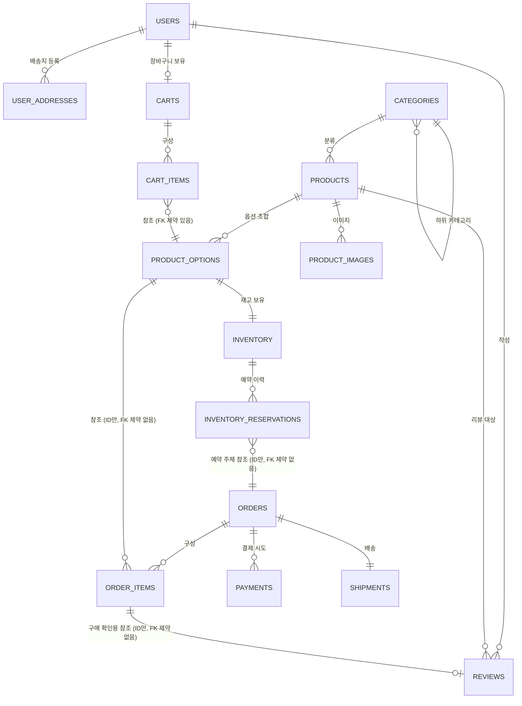

# DB 설계 (Database Design)

> 상태: 초안 (Draft) — 설계 승인자(기획자) 검토 필요
> 관련 문서: `docs/01_architecture/architecture-overview.md`, `docs/02_domain/domain-model.md`, `docs/03_database/naming-conventions.md`
> 전제: PostgreSQL 사용, 모듈러 모놀리스 구조에 맞춘 초기 설계, 주문/결제/재고는 명확히 분리, 실제 migration 파일은 아직 작성하지 않음.

> **문서 구성 안내**: 요청하신 11개 항목 중 "테이블별 목적 / 주요 컬럼 / PK·FK / Unique 제약 / Index 후보 / 상태값 컬럼"(2~7번)은 테이블마다 흩어놓기보다 **테이블별로 한데 모아** 정리했다. 각 테이블 설명 안에서 해당 항목을 모두 확인할 수 있다. 나머지 항목(생성/수정/삭제일 정책, Soft Delete, 트랜잭션 주의사항, AI 규칙)은 전체 공통 사항이라 별도 장으로 뒀다.

---

## 0. 이번 설계에서 확정한 전제

| 항목 | 결정 | 근거 문서 |
|---|---|---|
| 테이블명 | 접두어 없는 단순한 복수형 (`users`, `orders` 등) | `naming-conventions.md` |
| PK 타입 | UUID | `naming-conventions.md` |
| 상태값 저장 | 문자열(String) + 애플리케이션 검증 | `naming-conventions.md` |
| 재고 관리 단위 | 옵션 조합별 (Product 단위가 아님) | `domain-model.md` |
| 재고 예약 이력 | 별도 테이블(`inventory_reservations`)로 관리 (필수 테이블 목록에는 없었으나 재고 흐름의 정확한 구현을 위해 추가) | 이번 논의 |
| 도메인 경계 | 주문/결제/재고와 관련된 FK는 ID 참조만 사용, DB 제약(FK constraint) 없음 | `architecture-overview.md`, `domain-model.md` |

---

## 1. 테이블 목록

| 테이블명 | 소속 도메인 | 한 줄 설명 |
|---|---|---|
| `users` | User | 일반 회원 계정 |
| `user_addresses` | User | 회원이 등록한 배송지 목록 |
| `admin_users` | AdminUser | 관리자 계정 |
| `categories` | Category | 상품 분류 체계 |
| `products` | Product | 판매 상품 기본 정보 |
| `product_options` | ProductOption | 상품의 옵션 조합 (색상/사이즈 등) |
| `product_images` | Product | 상품 이미지 |
| `inventory` | Inventory 🔴 | 옵션 조합별 재고 수량 |
| `inventory_reservations` | Inventory 🔴 | 재고 예약/확정/해제 이력 |
| `carts` | Cart | 회원별 장바구니 |
| `cart_items` | Cart | 장바구니에 담긴 개별 항목 |
| `orders` | Order 🔴 | 주문 |
| `order_items` | Order 🔴 | 주문에 포함된 개별 상품 |
| `payments` | Payment 🔴 | 결제 시도 및 승인/실패 이력 |
| `shipments` | Shipment | 배송 상태 |
| `reviews` | Review | 상품 리뷰 (2차 고도화 대상, 구조만 선반영) |

---

## 2. 전체 관계도 (ERD)

**범례**: 실선 관계 중 일부는 실제 DB 외래키(FK) 제약이 걸려 있지 않고 **ID 값만 저장하는 논리적 참조**다. 아래 3장의 각 테이블 설명에서 "FK 제약 없음"이라고 명시된 컬럼이 여기 해당한다. (주문/결제/재고가 관련된 참조는 원칙적으로 FK 제약을 걸지 않는다 — `domain-model.md` 12장 참고)

---

## 3. 테이블별 상세 설계

각 테이블마다 **목적 → 주요 컬럼 → PK/FK → Unique 제약 → Index 후보 → 상태값**의 순서로 정리했다.

### 3-1. users (회원)

- **목적**: 서비스를 이용하는 일반 고객 계정 정보를 저장한다.
- **주요 컬럼**

| 컬럼 | 타입 | 설명 |
|---|---|---|
| id | UUID | PK |
| email | VARCHAR | 로그인 아이디로 사용, 중복 불가 |
| password_hash | VARCHAR | 비밀번호 해시값 (평문 저장 금지) |
| name | VARCHAR | 이름 |
| phone_number | VARCHAR | 연락처 |
| status | VARCHAR | 회원 상태 |
| login_fail_count | INTEGER | 로그인 실패 누적 횟수 (잠금 정책용, 구체적 임계치는 `domain-model.md` "확인 필요" 항목) |
| last_login_at | TIMESTAMP | 최근 로그인 시각 |
| withdrawn_at | TIMESTAMP | 탈퇴 처리 시각 (탈퇴 시 즉시 삭제하지 않고 이 값만 기록) |
| created_at | TIMESTAMP | 가입일 |
| updated_at | TIMESTAMP | 정보 수정일 |

- **PK/FK**: PK `id`. 이 테이블을 참조하는 FK는 다른 테이블에서 정의됨 (`user_addresses.user_id`, `carts.user_id` 등)
- **Unique 제약**: `email`
- **Index 후보**: `email`(고유 인덱스로 자동 생성), `status`(회원 상태별 관리자 조회용)
- **상태값(status)**: `ACTIVE`, `DORMANT`, `WITHDRAWN`

---

### 3-2. user_addresses (회원 배송지)

- **목적**: 회원이 미리 등록해둔 배송지 목록. 실제 주문 시에는 이 값을 **복사(스냅샷)**해서 `orders` 테이블에 저장하므로, 이 테이블의 값이 나중에 바뀌어도 과거 주문의 배송지에는 영향을 주지 않는다.
- **주요 컬럼**

| 컬럼 | 타입 | 설명 |
|---|---|---|
| id | UUID | PK |
| user_id | UUID | 소유 회원 |
| recipient_name | VARCHAR | 수령인 이름 |
| phone_number | VARCHAR | 수령인 연락처 |
| postal_code | VARCHAR | 우편번호 |
| address_line1 | VARCHAR | 기본 주소 |
| address_line2 | VARCHAR | 상세 주소 |
| is_default | BOOLEAN | 기본 배송지 여부 |
| created_at | TIMESTAMP | 등록일 |
| updated_at | TIMESTAMP | 수정일 |
| deleted_at | TIMESTAMP | 삭제(숨김) 시각 — Soft Delete |

- **PK/FK**: PK `id`. FK `user_id` → `users.id` (같은 도메인 내, **FK 제약 있음**)
- **Unique 제약**: 없음 (단, "회원당 기본배송지는 1개"라는 규칙은 애플리케이션 레벨에서 강제 — 부분 unique index로 구현 가능, 설계 시 검토)
- **Index 후보**: `user_id`
- **상태값**: 없음 (`is_default` 불리언으로 대체)

---

### 3-3. admin_users (관리자 계정)

- **목적**: 상품/주문 관리를 수행하는 관리자 계정. 고객 계정(`users`)과 완전히 분리된 별도 테이블이다.
- **주요 컬럼**

| 컬럼 | 타입 | 설명 |
|---|---|---|
| id | UUID | PK |
| login_id | VARCHAR | 관리자 로그인 아이디 |
| password_hash | VARCHAR | 비밀번호 해시값 |
| name | VARCHAR | 이름 |
| status | VARCHAR | 계정 상태 |
| last_login_at | TIMESTAMP | 최근 로그인 시각 |
| created_at | TIMESTAMP | 계정 생성일 |
| updated_at | TIMESTAMP | 수정일 |

- **PK/FK**: PK `id`. 다른 도메인 테이블을 참조하지 않는다.
- **Unique 제약**: `login_id`
- **Index 후보**: `login_id`(고유 인덱스로 자동 생성)
- **상태값**: `ACTIVE`, `DISABLED`

---

### 3-4. categories (카테고리)

- **목적**: 상품 분류 체계. 상위-하위 계층 구조를 지원한다 (예: "패션" 아래 "여성의류").
- **주요 컬럼**

| 컬럼 | 타입 | 설명 |
|---|---|---|
| id | UUID | PK |
| parent_id | UUID (nullable) | 상위 카테고리. 최상위는 NULL |
| name | VARCHAR | 카테고리명 |
| display_order | INTEGER | 노출 순서 |
| is_active | BOOLEAN | 노출 여부 |
| created_at | TIMESTAMP | 생성일 |
| updated_at | TIMESTAMP | 수정일 |
| deleted_at | TIMESTAMP | 삭제 시각 — Soft Delete |

- **PK/FK**: PK `id`. FK `parent_id` → `categories.id` (자기 참조, **FK 제약 있음**)
- **Unique 제약**: 없음 (같은 상위 카테고리 아래 이름 중복 방지가 필요하면 `(parent_id, name)` 복합 unique 고려 — ➕ 확인 필요)
- **Index 후보**: `parent_id`
- **상태값**: 없음 (`is_active`로 대체)
- **주의**: 카테고리 삭제 시 소속 상품 처리 방식은 `domain-model.md`에서 "확인 필요"로 남겨둔 사항이다. 정책이 정해지기 전까지는 Soft Delete(`deleted_at`)로만 처리하고, 소속 상품을 자동으로 변경/삭제하는 로직은 구현하지 않는다.

---

### 3-5. products (상품)

- **목적**: 판매되는 상품의 기본 정보.
- **주요 컬럼**

| 컬럼 | 타입 | 설명 |
|---|---|---|
| id | UUID | PK |
| category_id | UUID | 소속 카테고리 |
| name | VARCHAR | 상품명 |
| description | TEXT | 상품 설명 |
| base_price_amount | INTEGER | 기본 판매가 (원 단위 정수) |
| status | VARCHAR | 판매 상태 |
| created_at | TIMESTAMP | 등록일 |
| updated_at | TIMESTAMP | 수정일 |

- **PK/FK**: PK `id`. FK `category_id` → `categories.id` (**FK 제약 있음**)
- **Unique 제약**: 없음
- **Index 후보**: `category_id`, `status` (판매중 상품만 조회하는 경우가 많음)
- **상태값**: `ON_SALE`, `HIDDEN`, `DISCONTINUED`
- **주의**: 판매 이력이 있는 상품은 절대 하드 삭제하지 않는다. `DISCONTINUED`로만 전환한다 (`domain-model.md` 참고).

---

### 3-6. product_options (상품 옵션)

- **목적**: 상품의 세부 옵션 조합(예: "빨강/L"). 실제 재고와 주문의 최소 단위다.
- **주요 컬럼**

| 컬럼 | 타입 | 설명 |
|---|---|---|
| id | UUID | PK |
| product_id | UUID | 소속 상품 |
| option_name | VARCHAR | 옵션 조합명 (예: "빨강/L") |
| additional_price_amount | INTEGER | 옵션 추가금액 (없으면 0) |
| status | VARCHAR | 옵션 판매 상태 |
| created_at | TIMESTAMP | 생성일 |
| updated_at | TIMESTAMP | 수정일 |

- **PK/FK**: PK `id`. FK `product_id` → `products.id` (**FK 제약 있음**)
- **Unique 제약**: `(product_id, option_name)` — 같은 상품에 동일한 옵션 조합 중복 등록 방지
- **Index 후보**: `product_id`, `status`
- **상태값**: `ACTIVE`, `SOLD_OUT`, `HIDDEN`
- **주의**: 주문 이력에서 참조되므로 하드 삭제하지 않는다. 더 이상 팔지 않는 옵션은 `HIDDEN`으로 전환한다.

---

### 3-7. product_images (상품 이미지)

- **목적**: 상품에 첨부된 이미지 목록 (대표 이미지 포함).
- **주요 컬럼**

| 컬럼 | 타입 | 설명 |
|---|---|---|
| id | UUID | PK |
| product_id | UUID | 소속 상품 |
| image_url | VARCHAR | 객체 스토리지에 저장된 이미지 주소 |
| is_primary | BOOLEAN | 대표 이미지 여부 |
| display_order | INTEGER | 노출 순서 |
| created_at | TIMESTAMP | 등록일 |

- **PK/FK**: PK `id`. FK `product_id` → `products.id` (**FK 제약 있음**)
- **Unique 제약**: 없음 (단, "상품당 대표이미지는 1개"는 애플리케이션에서 강제)
- **Index 후보**: `product_id`
- **상태값**: 없음
- **삭제 정책**: 이 테이블은 하드 삭제(실제 삭제)를 사용한다 — 이력 보존 필요가 없는 자산 데이터이기 때문이다 (9장 참고).

---

### 3-8. inventory (재고)

- **목적**: 옵션 조합별 재고의 **현재 합계 수량**을 관리한다. 개별 예약/확정/해제 이력은 `inventory_reservations`에서 별도로 관리한다.
- **주요 컬럼**

| 컬럼 | 타입 | 설명 |
|---|---|---|
| id | UUID | PK |
| product_option_id | UUID | 대상 옵션 조합 (1:1) |
| total_quantity | INTEGER | 총 재고 수량 |
| reserved_quantity | INTEGER | 현재 예약(HELD) 중인 수량의 합 |
| created_at | TIMESTAMP | 생성일 |
| updated_at | TIMESTAMP | 최종 변경일 |

- **PK/FK**: PK `id`. FK `product_option_id` → `product_options.id` — Inventory는 🔴 분리 후보 도메인이고 ProductOption은 Catalog 도메인이므로 **FK 제약 없음** (ID 참조만)
- **Unique 제약**: `product_option_id` (옵션 조합당 재고 레코드는 1개만 존재 — 1:1 관계 보장)
- **Index 후보**: `product_option_id`(고유 인덱스로 자동 생성)
- **상태값**: 없음 (가용재고 = `total_quantity - reserved_quantity`는 저장하지 않고 조회 시 계산 — 값 불일치 방지)
- **주의**: `total_quantity`, `reserved_quantity`를 변경하는 모든 연산은 반드시 원자적(동시성 안전)으로 수행해야 한다 (5장 참고).

---

### 3-9. inventory_reservations (재고 예약 이력) — ➕ 추가 제안 테이블

- **목적**: 특정 주문이 특정 옵션의 재고를 "언제, 얼마나 예약했고, 확정됐는지 해제됐는지"를 개별 건 단위로 기록한다. `inventory`의 합계 수량만으로는 "이 예약이 어느 주문 것인지" 알 수 없기 때문에 별도로 둔다.
- **주요 컬럼**

| 컬럼 | 타입 | 설명 |
|---|---|---|
| id | UUID | PK |
| inventory_id | UUID | 대상 재고 (같은 Inventory 도메인 내, **FK 제약 있음**) |
| order_id | UUID | 예약 주체가 된 주문 — Order 참조, **FK 제약 없음** |
| quantity | INTEGER | 예약 수량 |
| status | VARCHAR | 예약 상태 |
| held_at | TIMESTAMP | 예약(HOLD) 시각 |
| confirmed_at | TIMESTAMP (nullable) | 확정(CONFIRM) 시각 |
| released_at | TIMESTAMP (nullable) | 해제(RELEASE) 시각 |
| expires_at | TIMESTAMP | 예약 유효시간(TTL) 만료 시각 — 구체적 TTL 값은 `domain-model.md` "확인 필요" 항목 |
| created_at | TIMESTAMP | 생성일 |

- **PK/FK**: PK `id`. FK `inventory_id` → `inventory.id` (**FK 제약 있음**). `order_id`는 Order(🔴) 참조이므로 **FK 제약 없음**
- **Unique 제약**: 없음 (하나의 주문이 여러 옵션에 대해, 또는 재시도로 인해 여러 예약 건을 가질 수 있음)
- **Index 후보**: `inventory_id`, `order_id`, `status`(만료된 예약 자동 정리 배치용), `expires_at`
- **상태값**: `HELD`, `CONFIRMED`, `RELEASED`

---

### 3-10. carts (장바구니)

- **목적**: 회원별 장바구니. 재고를 예약하지 않는 임시 데이터다.
- **주요 컬럼**

| 컬럼 | 타입 | 설명 |
|---|---|---|
| id | UUID | PK |
| user_id | UUID | 소유 회원 (1:1) |
| created_at | TIMESTAMP | 생성일 |
| updated_at | TIMESTAMP | 최종 수정일 |

- **PK/FK**: PK `id`. FK `user_id` → `users.id` (**FK 제약 있음**)
- **Unique 제약**: `user_id` (회원당 장바구니 1개)
- **Index 후보**: `user_id`(고유 인덱스로 자동 생성)
- **상태값**: 없음
- **삭제 정책**: 하드 삭제 사용 (이력 보존 불필요)

---

### 3-11. cart_items (장바구니 항목)

- **목적**: 장바구니에 담긴 개별 상품(옵션)과 수량.
- **주요 컬럼**

| 컬럼 | 타입 | 설명 |
|---|---|---|
| id | UUID | PK |
| cart_id | UUID | 소속 장바구니 |
| product_option_id | UUID | 담긴 옵션 조합 |
| quantity | INTEGER | 수량 |
| created_at | TIMESTAMP | 담은 시각 |
| updated_at | TIMESTAMP | 수량 변경 시각 |

- **PK/FK**: PK `id`. FK `cart_id` → `carts.id` (**FK 제약 있음**). FK `product_option_id` → `product_options.id` — Cart와 Catalog는 둘 다 분리 후보가 아니므로 **FK 제약 있음**
- **Unique 제약**: `(cart_id, product_option_id)` — 같은 옵션은 한 줄로 합치고 수량만 늘어나도록 강제
- **Index 후보**: `cart_id`
- **상태값**: 없음
- **삭제 정책**: 하드 삭제 사용

---

### 3-12. orders (주문) 🔴

- **목적**: 고객의 구매 확정 단위. 배송지 정보는 주문 시점 값을 스냅샷으로 저장한다.
- **주요 컬럼**

| 컬럼 | 타입 | 설명 |
|---|---|---|
| id | UUID | PK |
| order_number | VARCHAR | 고객에게 노출되는 주문번호 (예: 날짜+일련번호, `id`와 별도) |
| user_id | UUID | 주문자 — User 참조, FK 제약 없음 |
| status | VARCHAR | 주문 상태 |
| total_amount | INTEGER | 총 결제금액 |
| recipient_name | VARCHAR | 배송지 스냅샷: 수령인 |
| recipient_phone | VARCHAR | 배송지 스냅샷: 연락처 |
| postal_code | VARCHAR | 배송지 스냅샷: 우편번호 |
| address_line1 | VARCHAR | 배송지 스냅샷: 기본주소 |
| address_line2 | VARCHAR | 배송지 스냅샷: 상세주소 |
| created_at | TIMESTAMP | 주문일시 |
| updated_at | TIMESTAMP | 상태 변경 등 최종 수정일 |

- **PK/FK**: PK `id`. `user_id`는 User(비분리후보) 참조지만, Order 자신이 🔴 분리 후보이므로 **FK 제약 없음** (`domain-model.md` 12장 원칙 — 분리후보가 관련된 모든 FK는 제약 없음)
- **Unique 제약**: `order_number`
- **Index 후보**: `user_id`, `status`(관리자 주문 관리 화면에서 상태별 조회), `created_at`(최신순 정렬)
- **상태값**: `PENDING`, `PAID`, `PAYMENT_FAILED`, `PREPARING`, `SHIPPING`, `DELIVERED`, `CANCELED`
- **삭제 정책**: 삭제하지 않는다 (하드 삭제·소프트 삭제 모두 사용 안 함 — 거래 기록은 영구 보존)

---

### 3-13. order_items (주문 상품) 🔴

- **목적**: 주문에 포함된 개별 상품(옵션)과 수량, 주문 시점 가격 스냅샷.
- **주요 컬럼**

| 컬럼 | 타입 | 설명 |
|---|---|---|
| id | UUID | PK |
| order_id | UUID | 소속 주문 (같은 도메인, FK 제약 있음) |
| product_option_id | UUID | 옵션 조합 — Catalog 참조, FK 제약 없음 |
| product_name_snapshot | VARCHAR | 주문 시점 상품명 스냅샷 |
| option_name_snapshot | VARCHAR | 주문 시점 옵션명 스냅샷 |
| quantity | INTEGER | 수량 |
| unit_price_amount | INTEGER | 주문 시점 단가 스냅샷 |
| subtotal_amount | INTEGER | 소계 (단가 × 수량) |
| created_at | TIMESTAMP | 생성일 |

- **PK/FK**: PK `id`. FK `order_id` → `orders.id` (**FK 제약 있음**). `product_option_id`는 Catalog 참조이며 Order가 🔴 분리후보이므로 **FK 제약 없음**
- **Unique 제약**: 없음
- **Index 후보**: `order_id`
- **상태값**: 없음 (부분취소/부분환불은 2차 고도화 범위)
- **삭제 정책**: 삭제하지 않는다 (주문 기록의 일부이므로 영구 보존)

---

### 3-14. payments (결제) 🔴

- **목적**: 결제 시도부터 승인/실패/취소까지의 이력을 기록한다. 하나의 주문에 여러 시도(재결제 포함)가 있을 수 있다.
- **주요 컬럼**

| 컬럼 | 타입 | 설명 |
|---|---|---|
| id | UUID | PK |
| order_id | UUID | 대상 주문 — Payment와 Order 모두 🔴 분리후보이므로 FK 제약 없음 |
| status | VARCHAR | 결제 상태 |
| payment_method | VARCHAR | 결제 수단 (카드 등) |
| amount | INTEGER | 결제 금액 |
| pg_transaction_id | VARCHAR (nullable) | PG사 거래번호 |
| idempotency_key | VARCHAR | 중복 콜백 방지용 고유키 |
| failed_reason | VARCHAR (nullable) | 실패 사유 |
| requested_at | TIMESTAMP | 결제 요청 시각 |
| approved_at | TIMESTAMP (nullable) | 승인 시각 |
| created_at | TIMESTAMP | 생성일 |
| updated_at | TIMESTAMP | 최종 수정일 |

- **PK/FK**: PK `id`. `order_id`는 **FK 제약 없음** (ID 참조만)
- **Unique 제약**: `idempotency_key` (`domain-model.md` 8장 중복 콜백 처리의 핵심 장치)
- **Index 후보**: `order_id`, `status`, `pg_transaction_id`
- **상태값**: `REQUESTED`, `APPROVED`, `FAILED`, `CANCELED`
- **삭제 정책**: 삭제하지 않는다 (결제 이력은 영구 보존, 회계/분쟁 대응 목적)

---

### 3-15. shipments (배송)

- **목적**: 결제 완료된 주문의 배송 준비~완료 상태를 관리한다. 배송지 자체는 `orders`에 스냅샷으로 있으므로, 이 테이블은 배송 진행 상태에 집중한다.
- **주요 컬럼**

| 컬럼 | 타입 | 설명 |
|---|---|---|
| id | UUID | PK |
| order_id | UUID | 대상 주문 — Order가 🔴 분리후보이므로 FK 제약 없음 |
| status | VARCHAR | 배송 상태 |
| carrier_name | VARCHAR (nullable) | 택배사명 (MVP는 관리자 수동 입력) |
| tracking_number | VARCHAR (nullable) | 운송장번호 |
| shipped_at | TIMESTAMP (nullable) | 배송 시작 시각 |
| delivered_at | TIMESTAMP (nullable) | 배송 완료 시각 |
| created_at | TIMESTAMP | 생성일 (결제 완료 시점에 생성) |
| updated_at | TIMESTAMP | 최종 수정일 |

- **PK/FK**: PK `id`. `order_id`는 **FK 제약 없음**
- **Unique 제약**: `order_id` (주문당 배송 레코드 1개 — 1:1 관계)
- **Index 후보**: `order_id`(고유 인덱스로 자동 생성), `status`
- **상태값**: `PREPARING`, `SHIPPING`, `DELIVERED`
- **삭제 정책**: 삭제하지 않는다

---

### 3-16. reviews (리뷰) — 2차 고도화 대상, 구조만 선반영

- **목적**: 구매 확정된 상품에 대한 고객 평가. 지금 단계에서는 기능을 구현하지 않지만, 테이블 구조는 요청에 따라 함께 설계한다.
- **주요 컬럼**

| 컬럼 | 타입 | 설명 |
|---|---|---|
| id | UUID | PK |
| user_id | UUID | 작성자 (User, FK 제약 있음) |
| product_id | UUID | 대상 상품 (Product, FK 제약 있음) |
| order_item_id | UUID | 구매 확인용 참조 — Order 계열이므로 FK 제약 없음 |
| rating | SMALLINT | 평점 (1~5) |
| content | TEXT | 리뷰 내용 |
| status | VARCHAR | 노출 상태 (➕ 신규 정의 — `domain-model.md`에 리뷰 상태값이 없어 이번에 최소 정의함, 문서 동기화 필요) |
| created_at | TIMESTAMP | 작성일 |
| updated_at | TIMESTAMP | 수정일 |
| deleted_at | TIMESTAMP | 삭제(숨김) 시각 — Soft Delete |

- **PK/FK**: PK `id`. FK `user_id` → `users.id`(**있음**), FK `product_id` → `products.id`(**있음**). `order_item_id`는 Order 계열 참조이므로 **FK 제약 없음**
- **Unique 제약**: `(user_id, order_item_id)` — 같은 구매 건에 중복 리뷰 방지
- **Index 후보**: `product_id`, `user_id`
- **상태값**: `ACTIVE`, `HIDDEN` (➕ 신규 — `domain-model.md` 갱신 필요)
- **주의**: 이 테이블/기능은 MVP 범위가 아니므로, 실제 구현은 별도 승인 후 진행한다.

---

## 4. 생성일/수정일/삭제일 정책 (요청 항목 8)

| 컬럼 | 적용 대상 | 규칙 |
|---|---|---|
| `created_at` | 모든 테이블 | 레코드 생성 시각. 예외 없이 적용 |
| `updated_at` | 상태/내용이 변경될 수 있는 테이블 (거의 전부) | 마지막 수정 시각. 단순 이력 기록용 테이블(`order_items`, `product_images` 등 생성 후 값이 바뀌지 않는 테이블)은 생략 가능 |
| `deleted_at` | 아래 5장 "Soft Delete 사용 테이블"만 | NULL이면 미삭제, 값이 있으면 그 시각에 삭제(숨김) 처리됨 |

- 모든 시각 컬럼은 UTC 기준으로 저장하고, 화면에 보여줄 때 사용자 시간대로 변환한다.
- `orders`, `order_items`, `payments`, `shipments`는 **거래 기록이므로 삭제 관련 컬럼 자체를 두지 않는다** (삭제라는 개념이 존재하지 않음).

---

## 5. Soft Delete 사용 여부 (요청 항목 9)

테이블 성격에 따라 삭제 방식을 다르게 적용한다.

| 방식 | 적용 테이블 | 이유 |
|---|---|---|
| **상태값으로 논리 삭제** (`deleted_at` 없이 `status`만 사용) | `users`(WITHDRAWN), `products`(DISCONTINUED), `product_options`(HIDDEN), `admin_users`(DISABLED) | 이미 상태값 개념이 있고, 참조 이력(주문 등)이 있어 완전히 사라지면 안 되는 데이터 |
| **Soft Delete** (`deleted_at` 컬럼 사용) | `categories`, `user_addresses`, `reviews` | 상태값 개념이 없거나, 사용자가 "삭제"라고 인지하는 동작이 필요하지만 되돌릴 가능성을 남겨두는 것이 안전한 데이터 |
| **하드 삭제** (실제 행 삭제) | `carts`, `cart_items`, `product_images` | 이력 보존이 필요 없는 임시/자산 데이터 |
| **삭제 없음** (개념 자체가 없음) | `orders`, `order_items`, `payments`, `shipments`, `inventory`, `inventory_reservations` | 거래/재고 기록은 영구 보존이 원칙 (금융/회계 및 분쟁 대응 목적) |

---

## 6. 주문/결제/재고 관련 트랜잭션 주의사항 (요청 항목 10) 🔴

1. **주문 생성 + 재고 예약은 하나의 트랜잭션으로 묶는다.** 둘 중 하나만 성공하는 상황(주문은 생성됐는데 재고는 예약 안 됨, 또는 그 반대)이 있으면 안 된다.
2. **재고 예약 시 동시성 제어가 필수다.** 여러 주문이 동시에 들어와도 가용재고(=`total_quantity - reserved_quantity`) 이하로만 예약이 성립해야 한다. "가용재고를 먼저 조회하고 나중에 차감"하는 방식(조회-후-갱신)은 동시 요청 시 오버셀을 유발할 수 있으므로, **조건을 만족해야만 갱신되는 원자적 연산**(예: 갱신 대상 자체에 재고 조건을 거는 방식)을 사용해야 한다. 구체적 구현 방식은 실제 개발 단계에서 별도 설계 승인을 받는다.
3. **결제 승인 콜백 처리와 재고 확정은 하나의 트랜잭션으로 묶는다.** 결제만 승인되고 재고 확정이 누락되는 상황을 방지한다.
4. **외부 PG 호출처럼 느리고 실패할 수 있는 작업은 DB 트랜잭션 안에 넣지 않는다.** PG 호출은 트랜잭션 밖에서 수행하고, 그 결과(성공/실패)만 트랜잭션으로 반영한다. (트랜잭션이 오래 걸리면 락이 오래 유지되어 다른 주문 처리가 지연될 수 있음)
5. **하나의 주문에 두 건 이상의 결제가 동시에 `APPROVED`가 되지 않도록** 조건부 갱신 또는 잠금을 사용한다 (`domain-model.md` 8장 중복 콜백 처리 참고).
6. **지금은 모놀리스 안의 하나의 DB 트랜잭션으로 처리 가능하지만**, 향후 주문/결제/재고 중 일부가 별도 서비스로 분리되면 이 트랜잭션 경계를 그대로 유지할 수 없다. 그 시점에는 "보상 트랜잭션(Saga)" 같은 별도 패턴으로 재설계가 필요함을 미리 인지해둔다. (`architecture-overview.md` 11장 참고)
7. 트랜잭션 격리수준, 락 전략의 구체적 구현 방식은 이 문서에서 확정하지 않으며, 실제 구현 단계에서 별도로 설계 승인을 받는다. (➕ 확인 필요)

---

## 7. DB 변경 시 AI 에이전트가 지켜야 할 규칙 (요청 항목 11)

1. **이 문서에 정의되지 않은 테이블/컬럼을 임의로 추가하지 않는다.** 필요하다고 판단되면 먼저 사용자에게 제안하고 승인을 받는다.
2. **`docs/03_database/naming-conventions.md`의 명명 규칙을 예외 없이 따른다.** (테이블명 복수형, 접두어 없음, PK는 UUID, 상태값은 문자열 등)
3. **주문/결제/재고와 관련된 FK는 반드시 ID 참조만 사용하고 DB 외래키 제약을 걸지 않는다.** 이 문서에서 "FK 제약 없음"으로 명시한 관계에 실수로 제약을 추가하지 않는다.
4. **상태값(Enum) 컬럼에는 이 문서와 `domain-model.md`에 정의된 값만 사용한다.** 새로운 상태값이 필요하면 코드를 먼저 작성하지 않고 두 문서를 함께 갱신 제안한 뒤 승인을 받는다.
5. **DB 스키마 변경(테이블/컬럼 추가·삭제·타입 변경)은 적용 전 반드시 사전 보고한다.** (작업 원칙의 절대 규칙 4, `docs/rules-db-migration.md` 그대로 적용)
6. **마이그레이션은 항상 되돌릴 수 있는 형태(down migration)로 작성한다.** 파괴적 변경(컬럼/테이블 삭제)은 2단계로 진행한다 (`docs/rules-db-migration.md` 참고).
7. **`orders`, `order_items`, `payments`, `shipments`에는 삭제 관련 컬럼이나 삭제 로직을 추가하지 않는다.** (5장 "삭제 없음" 원칙)
8. **재고/결제 관련 트랜잭션 경계(6장)를 임의로 바꾸지 않는다.** 예를 들어 재고 확정과 결제 승인을 별도 트랜잭션으로 분리하는 등의 변경은 반드시 사전 승인 후 진행한다.
9. **이 문서의 "➕ 확인 필요/신규 제안" 표시가 있는 항목**(카테고리 삭제 정책, 예약 TTL, 리뷰 상태값 등)은 실제 구현 전에 확정되어야 하며, 확정 전에는 관련 기능 구현에 착수하지 않는다.

---

## 8. 승인 체크리스트

- [ ] 전체 테이블 목록(16개) 및 ERD 확인
- [ ] 테이블별 컬럼/PK·FK/Unique/Index 설계 승인
- [ ] 삭제 정책(상태값 논리삭제 / Soft Delete / 하드 삭제 / 삭제 없음) 승인
- [ ] 재고 예약 이력 테이블(`inventory_reservations`) 추가 확인
- [ ] Review 상태값(➕ 신규 정의) `domain-model.md`에 반영
- [ ] ➕ 확인 필요 항목 일괄 검토 (카테고리 삭제 정책, 재고 예약 TTL, 회원당 기본배송지 unique 처리 방식, 트랜잭션 격리수준/락 전략)
- [ ] 다음 단계(실제 Prisma schema 작성 / migration 파일 생성) 진행 승인

> 승인 전까지는 초안(Draft) 상태이며, migration 파일 및 실제 코드는 작성하지 않는다.
