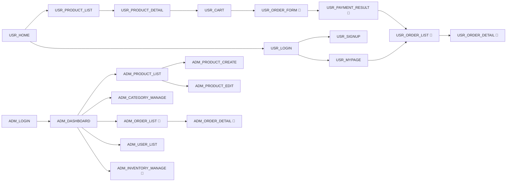

# 화면 목록 (Screen List)

> 상태: 초안 (Draft) — 설계 승인자(기획자) 검토 필요
> 관련 문서: `docs/03_api/api-list.md`, `docs/01_architecture/architecture-overview.md` (프론트엔드는 `apps/web`(고객), `apps/admin`(관리자)로 분리)
> 상세 화면 명세는 `docs/05_screen/screen-spec.md` 참고

## 화면 코드 규칙

- 고객 화면(`apps/web`)은 `USR_` 접두어, 관리자 화면(`apps/admin`)은 `ADM_` 접두어를 사용한다.
- `{접두어}_{화면 역할을 나타내는 영문 대문자 스네이크케이스}` 형태로 짓는다. (예: `USR_PRODUCT_LIST`, `ADM_ORDER_DETAIL`)
- 화면 코드는 설계 문서, 이슈, PR 제목 등에서 화면을 지칭할 때 항상 이 코드를 사용한다. (예: 이슈 제목 "[USR_CART] 수량 변경 시 합계 갱신 오류")

표시 규칙: 🔴 = 주문/결제/재고 관련 **위험 화면**, 🔒 = 로그인 필요, 🔒🔒 = 관리자 권한 필요

---

## 1. 사용자 화면 (`apps/web`)

| 코드 | 화면명 | 경로(Route) | 인증 | 비고 |
|---|---|---|---|---|
| `USR_HOME` | 메인 화면 | `/` | 불필요 | |
| `USR_LOGIN` | 로그인 화면 | `/login` | 불필요 | |
| `USR_SIGNUP` | 회원가입 화면 | `/signup` | 불필요 | |
| `USR_PRODUCT_LIST` | 상품 목록 화면 | `/products` | 불필요 | 카테고리/검색 결과 겸용 |
| `USR_PRODUCT_DETAIL` | 상품 상세 화면 | `/products/{productId}` | 불필요 | |
| `USR_CART` | 장바구니 화면 | `/cart` | 🔒 | |
| `USR_ORDER_FORM` | 주문서 화면 | `/checkout` | 🔒 | 🔴 결제 시작 지점 |
| `USR_PAYMENT_RESULT` | 결제 결과 화면 | `/orders/{orderId}/payment-result` | 🔒 | 🔴 |
| `USR_MYPAGE` | 마이페이지 | `/mypage` | 🔒 | |
| `USR_ORDER_LIST` | 주문 목록 | `/mypage/orders` | 🔒 | 🔴 |
| `USR_ORDER_DETAIL` | 주문 상세 | `/mypage/orders/{orderId}` | 🔒 | 🔴 취소 액션 포함 |

---

## 2. 관리자 화면 (`apps/admin`)

| 코드 | 화면명 | 경로(Route) | 인증 | 비고 |
|---|---|---|---|---|
| `ADM_LOGIN` | 관리자 로그인 | `/login` | 불필요 | |
| `ADM_DASHBOARD` | 관리자 대시보드 | `/` | 🔒🔒 | |
| `ADM_PRODUCT_LIST` | 상품 목록 | `/products` | 🔒🔒 | |
| `ADM_PRODUCT_CREATE` | 상품 등록 | `/products/new` | 🔒🔒 | |
| `ADM_PRODUCT_EDIT` | 상품 수정 | `/products/{productId}/edit` | 🔒🔒 | |
| `ADM_CATEGORY_MANAGE` | 카테고리 관리 | `/categories` | 🔒🔒 | |
| `ADM_ORDER_LIST` | 주문 목록 | `/orders` | 🔒🔒 | 🔴 |
| `ADM_ORDER_DETAIL` | 주문 상세 | `/orders/{orderId}` | 🔒🔒 | 🔴 상태변경/취소/환불 액션 |
| `ADM_USER_LIST` | 회원 목록 | `/users` | 🔒🔒 | |
| `ADM_INVENTORY_MANAGE` | 재고 관리 | `/inventory` | 🔒🔒 | 🔴 |

---

## 3. 화면 흐름 요약

---

## 4. 승인 체크리스트

- [ ] 화면 코드 규칙 승인
- [ ] 사용자 화면 11개 목록/경로 승인
- [ ] 관리자 화면 10개 목록/경로 승인
- [ ] 화면 흐름도 승인
- [ ] 다음 단계(`screen-spec.md` 상세 명세 검토) 진행 승인

> 승인 전까지는 초안(Draft) 상태이며, 코드는 작성하지 않는다.
